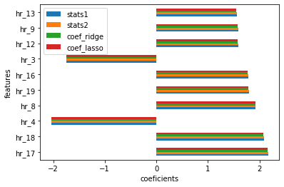

# Predicting Ridership DC Capital Bikeshare

* 06-03-2019 Flatiron Data Science Fellowship Module 4 group project 

Data Source: https://archive.ics.uci.edu/ml/datasets/Bike+Sharing+Dataset 
  *  This dataset contains the hourly and daily count of rental bikes between years 2011 and 2012 in Capital bikeshare system with the corresponding weather and seasonal information 
      * Original Source: http://capitalbikeshare.com/system-data 
      * Weather Information: http://www.freemeteo.com 
      * Holiday Schedule: http://dchr.dc.gov/page/holiday-schedule
  * 17379 rows and 15 features
      
 ## Members
- Mindy Zhou
- Joe McAllister

## Business Insights:
- Top 10 features for increasing or decreasing DC total bike rentals 
   - Method: Linear Regression
   - StatsModels 
   - sklearn RidgeCV, LassoCV, LinearRegressionCV
   - Target variable: total bike rentals (cnt)
- Top 10 features for more casual users than registered users
  - casual users: daily, weekly, or monthly pass (one time use)
  - registered users: daykey, monthly, yearly membership (recurring payment) 
  - Method: Logistic Regression
  - sklearn logistic regression 
  - Target variable: 1 for more casual users than registered users otherwise 0 
- Time Series Analysis: 
  - Monthly trend 
  - Seasonality 
  - Forecast model for future prediction 
  - StatsModel SARIMAX 
  - Target variable: total bike rentals (cnt)
  
## Results: 
- Linear Regression on total bike rentals:

  - Rush hours (8-9am, 12-1pm, 4-7pm) increases rental demand most 
  - Sleeping time (3-4am) decreases rental demand most 
  
- Logist Regression on more casual users than registered users:
  - Sleeping time (2-4am) has the biggest impact 
  - Warmer temperature and holiday seasons for more tourists 

- Time Series Analyses

  - Steady increasing trend from 2011 to 2013
    - Need more data for recent years since lyft and uber 
  - Bike demand reduces during cold and hot months and increases during mild weather months 
  
- Final Conclusions:

  - Hours of the day appears to have the most impact on both total rental demand and causal users being more common than registered users 
  - Better allocate resources during these hours 
  
- Follow-ups:
  - Gather more recent data 
  - Gather location data for more location focused marketing strategies
  
## File Summaries:
- bike_sharing_dataset
  - original raw datasets from UCI along with Readme.txt
- cleaned_data
  - cleaned dataframe for performing linear regression, logistic regression, and time series analyses 
- images:
  - images for README.md
- DC_Bike_Sharing_Mod4_Project.ipynb
  - Final Technical Jupyter Notebook with Emphasis on Readability 
- DC_Bike_Sharing_Project.pdf
  - PDF version of Google Slide presentation 
- biking_sharing_data_cleaning.ipynb
  - Detailed data cleaning along with feature transformation 
- helper_functions1.py
  - helperfunctions with classes to modularize and improve readability of DC_Bike_Sharing_Mod4_Project.ipynb

  
Google Slide Link: https://docs.google.com/presentation/d/1qnJeEjhnirk8CnebKaHb_3ECITmTdtwuEuynRNlAu_A/edit#slide=id.g5e50a81f87_0_96

  
